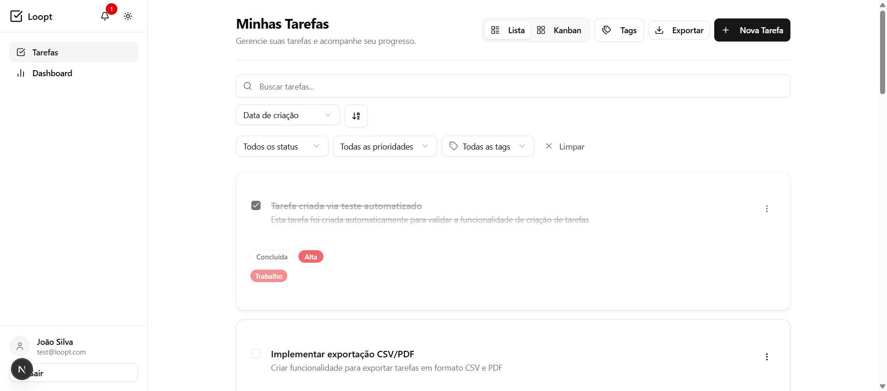
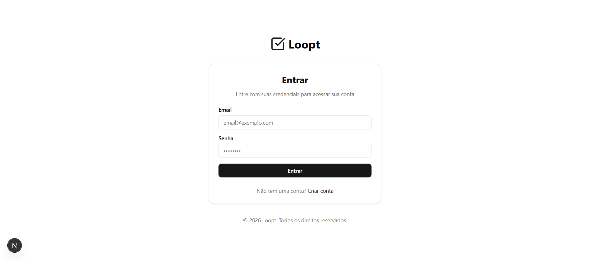
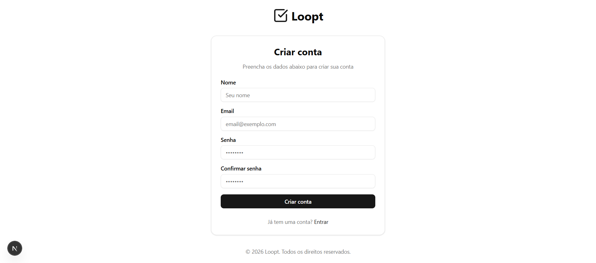
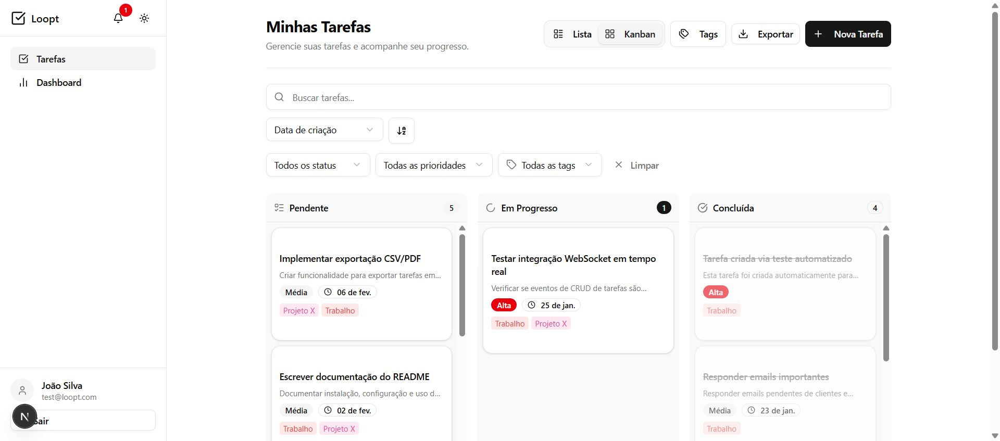
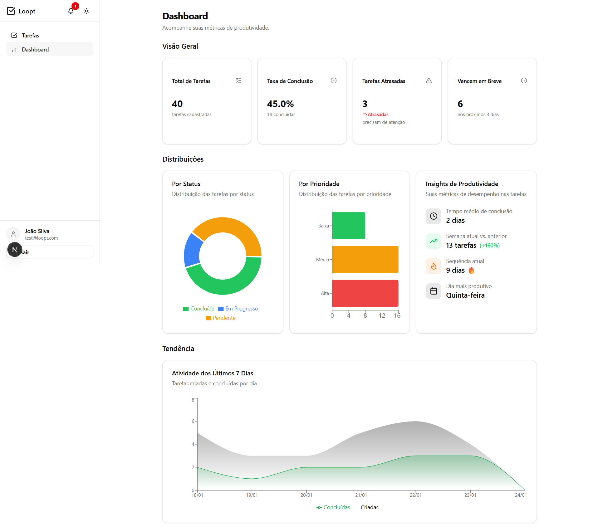
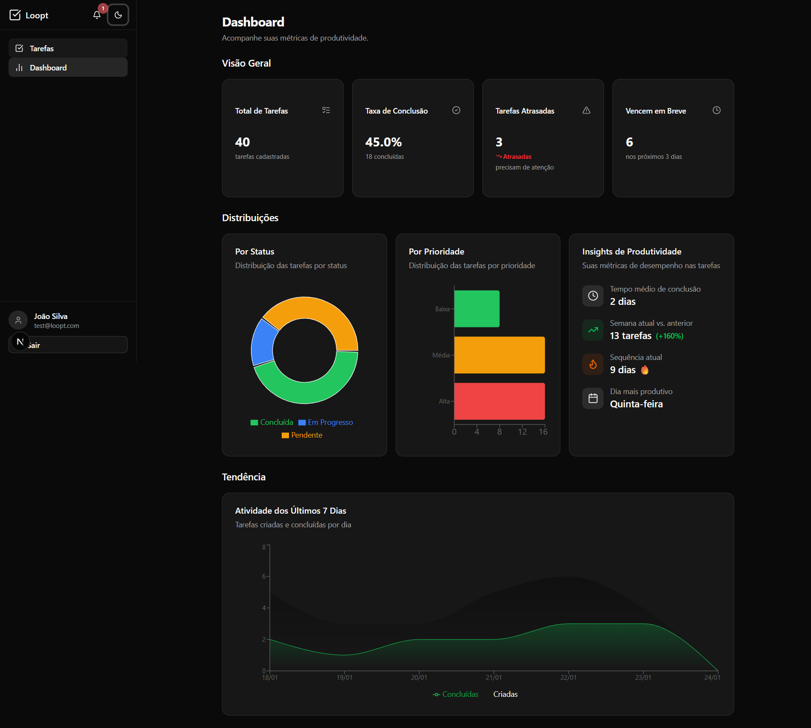
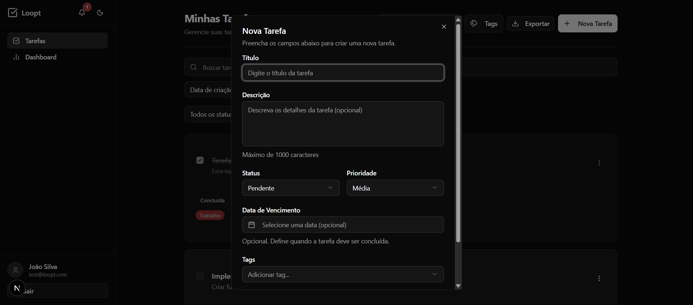
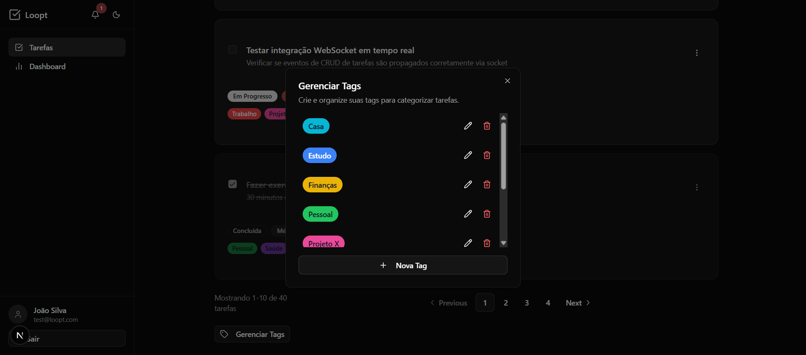

# Loopt - Gerenciador de Tarefas

<p align="center">
  
</p>

Sistema completo de gerenciamento de tarefas com dashboard de produtividade, desenvolvido como parte do **Desafio Técnico para Engenheiro Full Stack Pleno** da Loopt.

## Índice

- [Sobre o Projeto](#sobre-o-projeto)
- [Screenshots](#screenshots)
- [Tech Stack](#tech-stack)
- [Arquitetura](#arquitetura)
- [Pré-requisitos](#pré-requisitos)
- [Instalação e Execução](#instalação-e-execução)
- [Executando Testes](#executando-testes)
- [Documentação da API](#documentação-da-api)
- [Decisões Técnicas](#decisões-técnicas)
- [Diferenciais Implementados](#diferenciais-implementados)
- [Uso de IA no Desenvolvimento](#uso-de-ia-no-desenvolvimento)

---

## Sobre o Projeto

O **Loopt** é um gerenciador de tarefas moderno e completo que permite aos usuários:

- Criar, editar e excluir tarefas com título, descrição, status, prioridade e data de vencimento
- Organizar tarefas com tags personalizáveis
- Buscar tarefas por título ou descrição
- Filtrar por status, prioridade e tags de forma combinada
- Visualizar métricas de produtividade em um dashboard interativo
- Alternar entre tema claro e escuro
- Utilizar em qualquer dispositivo (responsivo)
- Receber notificações de tarefas atrasadas e próximas do vencimento
- Exportar tarefas em formato CSV ou PDF
- Visualizar atualizações em tempo real via WebSockets

---

## Demonstração em Produção

| Serviço            | URL                                            |
| ------------------ | ---------------------------------------------- |
| **Frontend**       | https://web-production-51c76.up.railway.app/   |
| **API do Swagger** | https://api-production-3aa6.up.railway.app/api |

**Credenciais de teste:**

- **Email:** `test@loopt.com`
- **Senha:** `test123`

---

## Screenshots

### Autenticação

<p align="center">
  
  
</p>

### Gestão de Tarefas

<p align="center">
  
</p>

<p align="center">
  
</p>

### Dashboard de Produtividade

<p align="center">
  
</p>

### Dark Mode

<p align="center">
  
</p>

### Modais e Funcionalidades

<p align="center">
  
  
</p>

---

## Tech Stack

### Backend

| Tecnologia          | Descrição                                                              |
| ------------------- | ---------------------------------------------------------------------- |
| **NestJS**          | Framework Node.js para construção de aplicações server-side escaláveis |
| **TypeORM**         | ORM para TypeScript/JavaScript com suporte a migrations                |
| **PostgreSQL 17**   | Banco de dados relacional                                              |
| **Redis 7**         | Cache e armazenamento em memória                                       |
| **RabbitMQ 4**      | Message broker para processamento assíncrono                           |
| **Socket.IO**       | WebSockets para atualizações em tempo real                             |
| **Passport/JWT**    | Autenticação via tokens JWT com refresh token                          |
| **class-validator** | Validação de DTOs                                                      |
| **Swagger**         | Documentação automática da API                                         |

### Frontend

| Tecnologia                | Descrição                                      |
| ------------------------- | ---------------------------------------------- |
| **Next.js 16**            | Framework React com App Router                 |
| **shadcn/ui**             | Componentes UI baseados em Radix UI + Tailwind |
| **TailwindCSS 4**         | Framework CSS utility-first                    |
| **Zustand**               | Gerenciamento de estado global                 |
| **TanStack Query**        | Data fetching e cache                          |
| **React Hook Form + Zod** | Formulários com validação                      |
| **Recharts**              | Gráficos interativos                           |
| **dnd-kit**               | Drag and drop para Kanban                      |
| **next-themes**           | Suporte a dark mode                            |
| **Socket.IO Client**      | WebSockets no cliente                          |
| **Axios**                 | HTTP client para comunicação com a API         |

### Infraestrutura

| Tecnologia         | Descrição                                |
| ------------------ | ---------------------------------------- |
| **Turborepo**      | Monorepo com build caching               |
| **pnpm**           | Gerenciador de pacotes eficiente         |
| **Docker Compose** | Containerização dos serviços             |
| **GitHub Actions** | CI/CD pipeline (lint, typecheck, deploy) |
| **Railway**        | Deploy em produção                       |

---

## Arquitetura

```
loopt/
├── apps/
│   ├── api/                    # Backend NestJS
│   │   ├── src/
│   │   │   ├── analytics/      # Módulo de métricas e analytics
│   │   │   ├── auth/           # Autenticação JWT + refresh token
│   │   │   ├── cache/          # Integração com Redis
│   │   │   ├── config/         # Validação de variáveis de ambiente
│   │   │   ├── database/       # Migrations e configuração TypeORM
│   │   │   ├── notifications/  # Integração com RabbitMQ
│   │   │   ├── tasks/          # CRUD de tarefas + WebSocket Gateway
│   │   │   └── users/          # Módulo de usuários
│   │   └── test/               # Testes de integração
│   │
│   ├── web/                    # Frontend Next.js
│   │   ├── src/
│   │   │   ├── app/            # App Router (páginas e layouts)
│   │   │   ├── components/     # Componentes React
│   │   │   ├── hooks/          # Custom hooks (useTasks, useAnalytics, etc.)
│   │   │   ├── lib/            # Utilitários e cliente API
│   │   │   ├── providers/      # Context providers
│   │   │   ├── stores/         # Zustand stores
│   │   │   └── stories/        # Storybook stories
│   │   └── .storybook/         # Configuração Storybook
│   │
│   └── worker/                 # Worker RabbitMQ
│       └── src/                # Consumidor de mensagens
│
├── packages/
│   ├── shared/                 # Tipos, enums e utilitários compartilhados
│   └── ui/                     # Componentes shadcn/ui compartilhados
│
├── docs/
│   └── screenshots/            # Screenshots da aplicação
│
├── docker-compose.yml          # Serviços de desenvolvimento
├── docker-compose.prod.yml     # Serviços de produção
└── turbo.json                  # Configuração Turborepo
```

### Modelo de Dados

```
┌─────────────────┐       ┌─────────────────┐       ┌─────────────────┐
│      User       │       │      Task       │       │      Tag        │
├─────────────────┤       ├─────────────────┤       ├─────────────────┤
│ id (UUID, PK)   │──┐    │ id (UUID, PK)   │       │ id (UUID, PK)   │
│ email (unique)  │  │    │ title           │       │ name            │
│ password (hash) │  │    │ description     │       │ color           │
│ name            │  ├───>│ status (enum)   │    ┌─>│ userId (FK)     │
│ createdAt       │  │    │ priority (enum) │    │  │ createdAt       │
│ updatedAt       │  │    │ dueDate         │    │  │ updatedAt       │
└─────────────────┘  │    │ order           │    │  └─────────────────┘
                     │    │ userId (FK)     │<───┘          │
                     │    │ completedAt     │               │
                     │    │ createdAt       │    ┌──────────┘
                     │    │ updatedAt       │    │  (ManyToMany)
                     │    └─────────────────┘    │
                     │            │              │
                     │            └──────────────┼───┐
                     │                           │   │
                     │    ┌─────────────────┐    │   │
                     │    │   task_tags     │<───┘   │
                     │    ├─────────────────┤        │
                     └───>│ taskId (FK)     │<───────┘
                          │ tagId (FK)      │
                          └─────────────────┘
```

**Relacionamentos:**

- User (1:N) Task - Um usuario possui varias tarefas
- User (1:N) Tag - Um usuario possui varias tags
- Task (N:N) Tag - Tarefas e tags tem relacionamento muitos-para-muitos via tabela `task_tags`

---

## Pré-requisitos

Certifique-se de ter instalado:

- **Node.js 20+** (recomendado: 22 LTS)
- **pnpm 9+** (`npm install -g pnpm`)
- **Docker** e **Docker Compose**
- **Git**

---

## Instalação e Execução

### 1. Clone o repositório

```bash
git clone https://github.com/thiag0bezerra/loopt.git
cd loopt
```

### 2. Instale as dependências

```bash
pnpm install
```

### 3. Configure as variáveis de ambiente

O projeto inclui arquivos `.env.example` com todas as variáveis necessárias documentadas:

```bash
# Copie os arquivos de exemplo
cp .env.example .env
cp apps/api/.env.example apps/api/.env
cp apps/web/.env.example apps/web/.env
```

**Variáveis principais:**

- `DATABASE_URL` - Connection string do PostgreSQL
- `REDIS_URL` - Connection string do Redis
- `RABBITMQ_URL` - Connection string do RabbitMQ
- `JWT_SECRET` - Chave secreta para assinatura de tokens (alterar em produção)
- `JWT_EXPIRES_IN` - Tempo de expiração do token (ex: 7d)

### 4. Inicie os serviços Docker

```bash
docker compose up -d
```

Isso iniciará:

- **PostgreSQL** na porta 5432
- **Redis** na porta 6379
- **RabbitMQ** na porta 5672 (management em 15672)

### 5. Execute as migrations

```bash
pnpm --filter api typeorm migration:run -d src/data-source.ts
```

### 6. (Opcional) Popule o banco com dados de teste

```bash
pnpm --filter api db:seed
```

Isso criará:

- Usuário de teste: `test@loopt.com` / `test123`
- Tags de exemplo
- 40 tarefas com diferentes status, prioridades e datas

### 7. Inicie a aplicação

```bash
pnpm dev
```

A aplicação estará disponível em:

- **Frontend**: http://localhost:3001
- **Backend API**: http://localhost:3000
- **Swagger**: http://localhost:3000/api
- **RabbitMQ Management**: http://localhost:15672 (guest/guest)

---

## Executando Testes

O projeto possui **95+ testes automatizados** distribuídos entre backend e frontend:

| Modulo     | Arquivo                                     | Testes |
| ---------- | ------------------------------------------- | ------ |
| **API**    | `auth.service.spec.ts`                      | 12     |
| **API**    | `tasks.service.spec.ts`                     | 13     |
| **API**    | `database.integration.spec.ts`              | 13     |
| **API**    | `redis.integration.spec.ts`                 | 17     |
| **API**    | `notifications.integration.spec.ts`         | 5      |
| **Worker** | `notification-consumer.integration.spec.ts` | 9      |
| **Web**    | `task-card.test.tsx`                        | 12     |
| **Web**    | `task-filters.test.tsx`                     | 5      |
| **Web**    | `kpi-card.test.tsx`                         | 9      |

### Todos os testes

```bash
pnpm test
```

### Testes do backend (60+ testes)

```bash
pnpm --filter api test
```

### Testes do frontend (26 testes)

```bash
pnpm --filter web test
```

### Testes com cobertura

```bash
pnpm --filter api test:cov
pnpm --filter web test:cov
```

### Storybook (desenvolvimento de componentes)

```bash
pnpm --filter web storybook
```

Acesse em http://localhost:6006

---

## Documentação da API

A documentação interativa da API está disponível via **Swagger** em:

- **Desenvolvimento**: http://localhost:3000/api
- **Produção**: https://[sua-url]/api

### Principais Endpoints

| Método | Endpoint                      | Descrição                                      |
| ------ | ----------------------------- | ---------------------------------------------- |
| POST   | `/auth/register`              | Registrar novo usuário                         |
| POST   | `/auth/login`                 | Login (retorna access + refresh token)         |
| POST   | `/auth/refresh`               | Renovar access token                           |
| GET    | `/auth/me`                    | Obter usuário autenticado                      |
| GET    | `/tasks`                      | Listar tarefas (filtros, paginação, ordenação) |
| POST   | `/tasks`                      | Criar tarefa                                   |
| GET    | `/tasks/:id`                  | Obter tarefa específica                        |
| PATCH  | `/tasks/:id`                  | Atualizar tarefa                               |
| DELETE | `/tasks/:id`                  | Excluir tarefa                                 |
| PATCH  | `/tasks/reorder`              | Reordenar tarefas (drag & drop)                |
| GET    | `/tags`                       | Listar tags do usuário                         |
| POST   | `/tags`                       | Criar tag                                      |
| PATCH  | `/tags/:id`                   | Atualizar tag                                  |
| DELETE | `/tags/:id`                   | Excluir tag                                    |
| GET    | `/analytics/overview`         | Métricas gerais                                |
| GET    | `/analytics/by-status`        | Distribuição por status                        |
| GET    | `/analytics/by-priority`      | Distribuição por prioridade                    |
| GET    | `/analytics/completion-trend` | Tendência de conclusão                         |
| GET    | `/analytics/productivity`     | Indicadores de produtividade                   |

---

## Decisões Técnicas

### Monorepo com Turborepo

Optei pelo Turborepo para:

- **Build caching**: builds incrementais muito mais rápidos
- **Task orchestration**: comandos paralelos com dependências
- **Compartilhamento de código**: packages `shared` e `ui` reutilizáveis

### NestJS no Backend

Escolhi NestJS por:

- Arquitetura modular e escalável
- Suporte nativo a WebSockets, microservices e message brokers
- Decorators para validação e documentação automática
- Ecossistema maduro com TypeORM, Passport, etc.

### shadcn/ui no Frontend

Utilizei shadcn/ui porque:

- Componentes copiados para o projeto (total controle)
- Baseado em Radix UI (acessibilidade garantida)
- Integração perfeita com Tailwind CSS
- Suporte nativo a dark mode via CSS variables

### Redis para Cache

Implementei cache com Redis para:

- Reduzir carga no banco de dados
- Melhorar tempo de resposta em listagens
- Invalidação automática ao modificar dados

### RabbitMQ para Mensageria

Utilizei RabbitMQ para:

- Processamento assíncrono de notificações
- Desacoplamento entre API e worker
- Escalabilidade horizontal do processamento

### WebSockets para Tempo Real

Implementei Socket.IO para:

- Atualização instantânea da lista de tarefas
- Melhor experiência do usuário
- Sincronização entre múltiplas abas/dispositivos

### Rotas Protegidas no Frontend

Implementei proteção de rotas utilizando:

- Componente `ProtectedRoute` que verifica autenticação via Zustand store
- Route group `(protected)` do Next.js App Router para agrupar páginas privadas
- Redirecionamento automático para `/login` quando não autenticado
- Loading skeleton durante verificação de autenticação

### HTTP Client com Axios

Utilizei Axios como HTTP client por:

- Interceptors para injeção automática de token JWT
- Interceptor de resposta para refresh token automático
- Tratamento centralizado de erros
- Tipagem forte com TypeScript

---

## Diferenciais Implementados

| Feature                      | Descrição                                           |
| ---------------------------- | --------------------------------------------------- |
| **Monorepo Turborepo**       | Build caching e task orchestration                  |
| **Worker RabbitMQ**          | Processamento assíncrono de notificações            |
| **Cache Redis**              | Listagens e analytics cacheados                     |
| **WebSockets**               | Atualizações em tempo real                          |
| **Refresh Token**            | Renovação segura de autenticação                    |
| **Dark Mode**                | Tema claro/escuro persistente                       |
| **Drag & Drop Kanban**       | Reordenação visual de tarefas                       |
| **Tags/Categorias**          | Organização flexível de tarefas                     |
| **Export CSV/PDF**           | Exportação de dados                                 |
| **Notificações In-App**      | Alertas de tarefas atrasadas/próximas               |
| **Gráficos Interativos**     | Dashboard com Recharts                              |
| **Storybook**                | Documentação visual de componentes                  |
| **GitHub Actions CI/CD**     | Lint, typecheck e deploy automatizado para Railway  |
| **Deploy Railway**           | API, Worker e Web em produção                       |
| **Migrations Commitadas**    | 4 migrations versionadas no repositório             |
| **Rotas Protegidas**         | Componente ProtectedRoute + route group (protected) |
| **95+ Testes Automatizados** | 69 backend + 26 frontend com Vitest                 |
| **Busca de Tarefas**         | Busca por título e descrição (ILIKE)                |
| **Filtros Avançados**        | Filtros combinados por status, prioridade e tags    |
| **Acessibilidade (ARIA)**    | Labels e atributos ARIA em componentes interativos  |

---

## Uso de IA no Desenvolvimento

Este projeto foi desenvolvido com auxílio de **GitHub Copilot (Claude Opus 4.5)** como ferramenta de produtividade. A IA foi utilizada para:

### Geração de Código Boilerplate

- Configuração inicial de módulos NestJS (DTOs, controllers, services)
- Setup de configurações (TypeORM, Swagger, validação)
- Estrutura de componentes React com shadcn/ui

### Aceleração de Tarefas Repetitivas

- Criação de migrations baseadas em entities
- Implementação de testes unitários
- Stories do Storybook para componentes

### Resolução de Problemas

- Debug de configurações de monorepo
- Integração de bibliotecas (dnd-kit, Recharts, Socket.IO)
- Otimização de queries TypeORM

### Documentação

- Geração de documentação Swagger
- Criação deste README
- Comentários em código complexo

### Processo de Trabalho

1. **Planejamento**: Defini a arquitetura e funcionalidades no [TODO.md](docs/TODO.md)
2. **Iteração**: Para cada ciclo, descrevi requisitos e a IA sugeriu implementações
3. **Revisão**: Todo código gerado foi revisado, testado e ajustado
4. **Refinamento**: Melhorias incrementais baseadas em feedback e testes

A IA funcionou como um **pair programmer** eficiente, permitindo focar nas decisões de arquitetura e lógica de negócio enquanto acelerava a implementação.

---

## Licença

Este projeto foi desenvolvido como parte de um desafio técnico e não possui licença de uso público.

---

**Desenvolvido para o Desafio Técnico Loopt**
